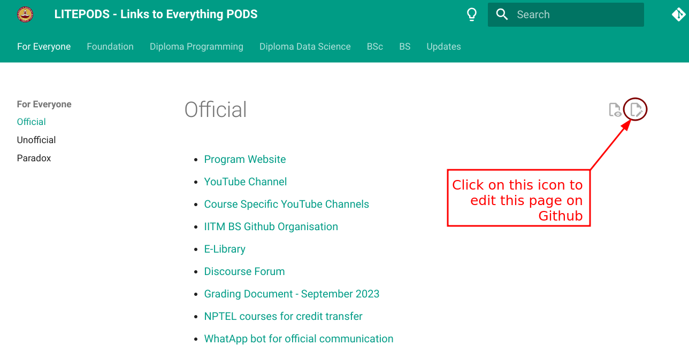

# How to Contriubte

This is a collborative project. Add anything you find missing on this website. 

On every page of this site, you'll find an icon on the top right as shown below.

Clicking on this page will ask to you to **fork** this repository. 

!!! Question "What is Forking?"
    Forking means creating a copy of this repository in your own github account

You've to click `fork this repository`.
After making appropriate changes (add/update links) you've to create pull request. Which will send a message to the authorized repository people to accept/suggest something about your changes.

After being merged, your changes will reflect on the site.

!!! tip "Mark your Presence!!!"
   If you don't have any new idea for any change, but you still want to try editing, try adding your name and a link, to your github account, or any of your projects [on this page](contribute/we-are-the-contributors.md). This will get you started editing a document, without actually having something to edit. `Have fun!!`
